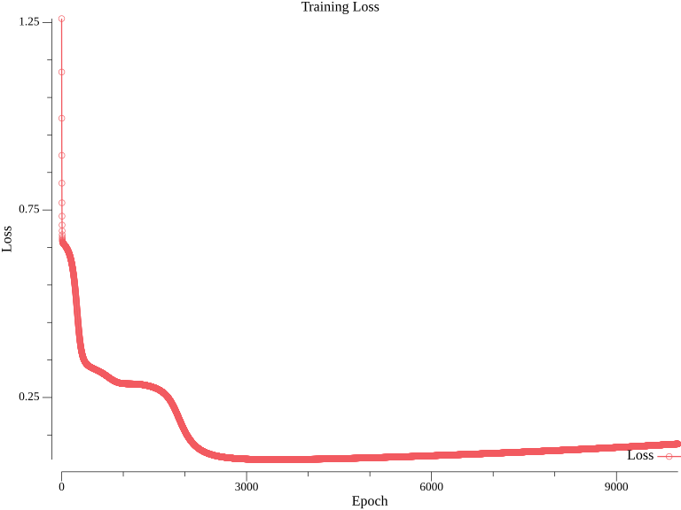

# Neural Network Training with Go

This project implements a simple neural network using the Go programming language. The network is trained using backpropagation with L2 regularization and can be used for classification tasks. The training and testing data are read from CSV files, and the performance metrics are printed and plotted.

## Features
- Neural network with one hidden layer
- Training using backpropagation with L2 regularization
- Accuracy, precision, recall, and F1-score calculations
- Plots for training accuracy and loss

## Requirements
- Go 1.14+
- gonum package
- gonum/plot package

## Installation

1. *Clone the repository:*

   sh
   git clone https://github.com/yourusername/neural-network-go.git
   cd neural-network-go
   

2. *Install dependencies:*

   sh
   go get -u gonum.org/v1/gonum/...
   go get -u gonum.org/v1/plot/...
   

## Usage

1. *Prepare the data:*
   - Place your training data in data/train.csv
   - Place your testing data in data/test.csv

   The CSV files should have the following format:

   
   feature1,feature2,feature3,feature4,label1,label2,label3
   

2. *Run the program:*

   sh
   go run main.go
   

3. *Check the output:*
   - The program will print the accuracy, precision, recall, and F1-score of the trained network.
   - Plots for training accuracy and loss will be saved as accuracy_plot.png and loss_plot.png.

## Results

After training the neural network, the following metrics were achieved:

- *Accuracy:* 94%
- *Precision:* 94%
- *Recall:* 94%
- *F1-Score:* 94%

### Accuracy Plot

### Loss Plot

## Code Structure

- main.go: The main file containing the neural network implementation, training, and evaluation code.
- data/: Directory to store training and testing CSV files.

## Detailed Code Overview

### Main Functions

- *main()*
  - Sets up the network configuration.
  - Trains the network.
  - Evaluates the network's performance.
  - Plots the metrics.
  
- *newNetwork(config neuralNetConfig) *neuralNet*
  - Initializes a new neural network with the given configuration.

- *train(x, y *mat.Dense) ([]float64, []float64, error)*
  - Trains the neural network using backpropagation with L2 regularization.
  - Returns the training accuracy and loss over epochs.

- *calculateLoss(predictions, labels *mat.Dense) float64*
  - Calculates the mean squared error loss.

- *predict(x *mat.Dense) (*mat.Dense, error)*
  - Makes predictions using the trained network.

- *calculateAccuracy(predictions, labels *mat.Dense) float64*
  - Calculates the accuracy of the predictions.

- *calculatePrecision(predictions, labels *mat.Dense) float64*
  - Calculates the precision of the predictions.

- *calculateRecall(predictions, labels *mat.Dense) float64*
  - Calculates the recall of the predictions.

- *calculateF1Score(precision, recall float64) float64*
  - Calculates the F1-score from precision and recall.

- *sigmoid(x float64) float64*
  - Sigmoid activation function.

- *sigmoidPrime(x float64) float64*
  - Derivative of the sigmoid function.

- *sumAlongAxis(axis int, m *mat.Dense) (*mat.Dense, error)*
  - Sums elements along a specified axis of a matrix.

- *makeInputsAndLabels(fileName string) (*mat.Dense, *mat.Dense)*
  - Reads the CSV file and returns the inputs and labels matrices.

- *plotMetrics(accuracy, loss []float64)*
  - Plots the training accuracy and loss.

## Contributing
Contributions are welcome! Please open an issue or submit a pull request for any improvements or new features.

### Steps to Contribute:
1. *Fork the repository:*

   sh
   git clone https://github.com/yourusername/neural-network-go.git
   cd neural-network-go
   

2. *Create a new branch for your feature or bugfix:*

   sh
   git checkout -b feature-or-bugfix-name
   

3. *Make your changes and commit them:*

   sh
   git commit -am 'Add new feature or fix'
   

4. *Push your branch to GitHub:*

   sh
   git push origin feature-or-bugfix-name
   

5. *Create a Pull Request:*
   - Go to the repository on GitHub.
   - Click on the "New Pull Request" button.
   - Provide a description of your changes and submit the PR.

## License
This project is licensed under the MIT License. See the LICENSE file for details.

## Acknowledgements
- The gonum and gonum/plot packages for numerical computations and plotting in Go.
- Inspiration and guidance from various online resources and the Go community.

## Contact
For any questions or suggestions, please open an issue or contact the repository owner.

---

